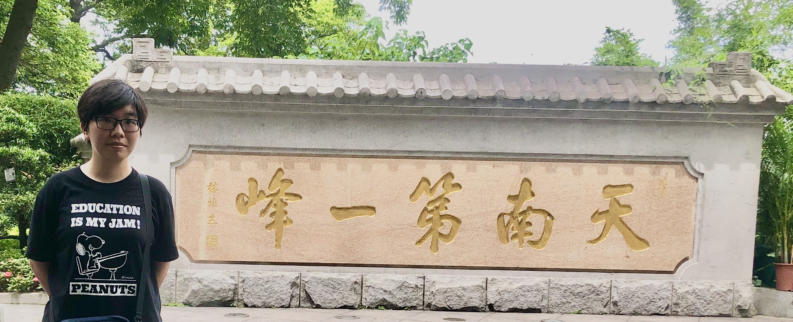

I am currently a postdoc at the math department of the University of Oklahoma, my mentor is [András Cristian Lőrincz](https://math.ou.edu/~alorincz/).

In Summer 2024, I obtained my PhD in mathematics from the [math department of University of Illinois at Chicago](https://mscs.uic.edu/), where my advisor was [Wenliang Zhang](https://wlzhang.people.uic.edu/).

### Research Interests
I am broadly interested in commutative algebra and algebraic geometry. Specifically, I am interested in understanding local cohomology modules, D-modules and singularity problems in any characteristic. 

#### My most recent [CV](Curriculum_Vitae.pdf).

#### Papers
  - Vanishing of Local cohomology and Segre products (with Wenliang Zhang), in preparation.
  - On the generalized multiplicities of maximal minors and sub-maximal pfaffians, [arxiv](https://arxiv.org/abs/2205.09657), submitted.
  - Singularities of generic linkage via Frobenius powers, [arxiv](https://arxiv.org/abs/2207.06380), accepted to Proc. Amer. Math. Soc.
  - Socle degrees for local cohomology modules of thickenings of maximal minors and sub-maximal Pfaffians (with [Michael Perlman](https://sites.google.com/view/michaelperlman/home?authuser=0)), [arxiv](https://arxiv.org/abs/2212.06899), accepted to Proc. Amer. Math. Soc.
      
<!-- #### Talks
  - Commutative algebra seminar, Purdue University, Nov 2023
  - Commutative algebra seminar, University of Michigan, Nov 2023
  - Algebra days in Arizona, Arizona State University, Nov 2023.
  - "Commutative Algebra, Differential Operators, and Singularities", AMS Sectional Meeting, Creighton University, October 2023.
  - Commutative algebra and algebraic geometry seminar, University of Minnesota, October, 2022.
  - Special session of commutative algebra, AMS Sectional Meeting, University of Utah, October 2022.
  - "Recent developments in commutative algebra”, AMS Sectional Meeting, Purdue University, March 2022.
  - Commutative Algebra seminar, UIC, March 2022. 

#### Other presentations
- Lightening talk at Macaulay2 workshop at UMN 2023.
- Poster at 2023 JMM AWM section, Boston.
- Poster at KUMUNU 2022 Fall.
- Several talks at the graduate student algebraic geometry seminar and the graduate student number theory seminar at UIC.
-->
  
#### Teaching (at OU)
- Spring 2025: Math 3333 (Linear Algebra)
- Fall 2024: Math 3113 (Ordinary Differential Equations)
  
### Contact
jiamin dot li at ou dot edu
